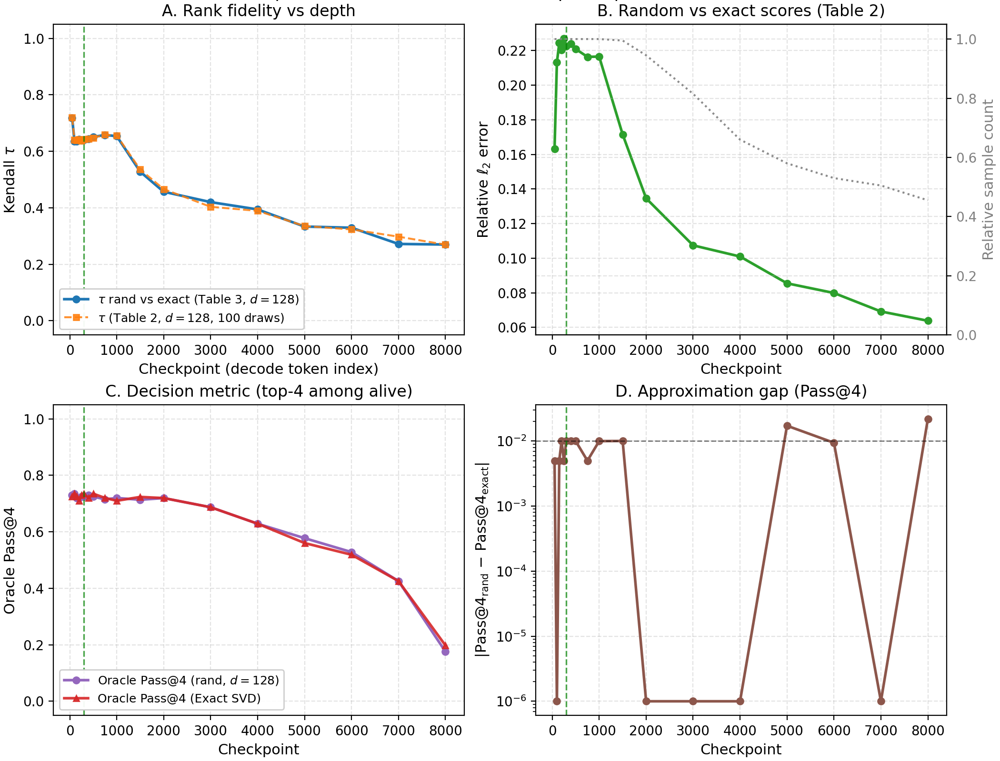
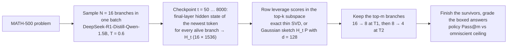

# Leverage-Score Branch Pruning for Best-of-N LLM Reasoning

**Training-free pruning of parallel reasoning branches using (randomized) leverage scores of their hidden states.**
A controlled study on DeepSeek-R1-Distill-Qwen-1.5B × MATH-500: a few hundred tokens into decoding, can a cheap linear-algebra signal decide which of 16 sampled branches are worth finishing?

[](https://github.com/nathan215/rnla-pruning/actions/workflows/ci.yml)
[](requirements.txt)
[](LICENSE)

## TL;DR

| | |
|---|---|
| **Setting** | 200 MATH-500 problems, 16 sampled branches each (temperature 0.6, up to 8192 new tokens), DeepSeek-R1-Distill-Qwen-1.5B in bf16 |
| **Ceiling** | Pass@1 = 65.0 %. Oracle Pass@16 (at least one of the 16 finished branches is correct) = 76.5 % |
| **Signal** | Row leverage scores of the branch hidden-state matrix `H_t` (16 × 1536: final layer, newest token) in its top-k singular subspace, k = 8. Exact via thin SVD, or sketched with a seeded Gaussian projection to d = 128 dimensions |
| **Finding 1** | Pruning 16 → 8 → 4 as early as tokens 50 and 300 keeps Pass@4 between 71.5 % and 74.0 % across all 13 schedules tried, against 76.5 % for finishing all 16 branches. For those schedules that is roughly 3.3–3.6× fewer decoded tokens (back-of-envelope estimate, see [Results §3](#3-pruning-schedules-step-23)) |
| **Finding 2** | The sketch is faithful: at d = 128, policy Pass@4 is within 0.6 pp of exact SVD at the hero checkpoint (Kendall τ = 0.64) and within about 2 pp at every one of the 18 checkpoints |
| **Finding 3 (negative)** | Leverage beats log-prob and random retention by only 0.5–3 pp at checkpoint 300. With n = 200 the standard error of a pass rate is about 3 pp, so the retention policies are statistically indistinguishable |
| **Finding 4 (negative)** | At N = 16, D = 1536 the exact thin SVD already takes 0.33 ms per call on a single CPU thread, so sketching buys approximation quality, not wall-clock time, at this scale |

<p align="center"></p>

## Method



1. **Collect traces (Step 1).** For each problem, sample 16 branches in one batch. At every checkpoint record, per branch, the final-layer hidden state of the token just generated, the cumulative log-probability, and whether the branch is still alive. At the end, grade each branch's `\boxed{}` answer against the reference (`experiments/step_1_oracle_collection.py`, `src/step1_oracle.py`).
2. **Score branches.** For the alive rows of `H_t`, the leverage score of branch *i* is the squared norm of row *i* of `U_k`, the top-k left singular vectors (`src/leverage.py`). The randomized variant first sketches `H_t` to `H_t P` with a seeded Gaussian `P` of shape 1536 × d, then takes the SVD of the much smaller matrix.
3. **Compare retention policies.** Keep the top-m branches by exact leverage, randomized leverage, cumulative log-prob, or uniformly at random, and ask whether at least one kept branch is correct (policy Pass@m). The omniscient ceiling is 1 whenever any alive branch is correct (`src/step2_metrics.py`, [`results/step_2_1/oracle_pass_m_policy.md`](results/step_2_1/oracle_pass_m_policy.md)).
4. **Measure the sketch.** Kendall τ and relative ℓ2 error between randomized and exact scores, an ablation over d, a noise-injection check, and per-call timing (`experiments/step2_2_approximation.py`, `experiments/benchmark_n16_leverage_timing.py`).
5. **Sweep schedules.** Sequential two-stage pruning, 16 → 8 at T1 then 8 → 4 at T2, over 13 (T1, T2) pairs (`experiments/step2_3_schedule_sweep.py`).

All pruning is simulated post hoc on the recorded traces, so every policy is evaluated on exactly the same 3,200 branches.

## Results

All numbers are on the same 200 problems. Every table links to the file it was generated from.

### 1. Retention policies at checkpoint 300 (Step 2.1)

Policy Pass@m is the fraction of problems where at least one of the m kept branches is correct. Source: [`results/step_2_1/table1_latex_snippet.md`](results/step_2_1/table1_latex_snippet.md); all 18 checkpoints in [`oracle_pass_m_summary.md`](results/step_2_1/oracle_pass_m_summary.md).

| Policy | Pass@1 | Pass@2 | Pass@4 | Pass@8 |
|---|---:|---:|---:|---:|
| Omniscient ceiling (any alive branch correct) | 76.5 | 76.5 | 76.5 | 76.5 |
| Random retention (1000 trials) | 64.2 | 69.7 | 72.7 | 74.7 |
| Top-m cumulative log-prob | 62.5 | 69.5 | 72.0 | 74.5 |
| **Top-m leverage (exact SVD, k = 8)** | **65.5** | **71.0** | **73.5** | **75.0** |

Leverage is ahead of log-prob by 3.0 / 1.5 / 1.5 / 0.5 pp and ahead of random by 1.3 / 1.3 / 0.8 / 0.3 pp. Read these with the roughly 3 pp standard error in mind.

### 2. Randomized vs exact leverage (Step 2.2)

Checkpoint 300, k = 8. Pass@4 for the randomized policy is averaged over 50 projection seeds per problem. Sources: [`table3_ablation_d.md`](results/step_2_2/table3_ablation_d.md), [`table2_stability.md`](results/step_2_2/table2_stability.md), [`noise_injection_pass.md`](results/step_2_2/noise_injection_pass.md).

| Sketch dimension d | Kendall τ vs exact | Policy Pass@4 |
|---:|---:|---:|
| 8 | 0.24 | 72.4 |
| 32 | 0.45 | 72.7 |
| 128 | 0.64 | 72.9 |
| 512 | 0.79 | 72.9 |
| 1024 | 0.84 | 73.0 |
| exact SVD (D = 1536) | 1.00 | 73.5 |

* Even d = 8 (τ ≈ 0.24) loses only about 1 pp of Pass@4: the decision "which 4 of 16 to keep" is far more robust than the scores themselves.
* Injecting Gaussian noise into `H_t` (η up to 0.2) degrades the exact and randomized policies alike, so the sketch is an approximation, not a denoiser.
* Per-call cost at N = 16, D = 1536, k = 8 on a single CPU thread ([`leverage_timing_microbench.json`](results/leverage_timing_microbench.json)): exact 0.33 ms, d = 64 0.45 ms, d = 128 0.82 ms, d = 256 1.55 ms. The projection GEMM dominates at this size. Sketching only pays off once N or D is much larger.

### 3. Pruning schedules (Step 2.3)

Sequential pruning 16 → 8 at T1, then 8 → 4 at T2 (d = 128, 24-seed ensemble, 48 random trials). Source: [`results/step_2_3/schedule_sweep.md`](results/step_2_3/schedule_sweep.md).

| T1 | T2 | Seq. randomized leverage | Seq. exact leverage | Seq. log-prob | Seq. random | Oracle Pass@16 |
|---:|---:|---:|---:|---:|---:|---:|
| 50 | 100 | 72.5 | 73.0 | 72.0 | 72.6 | 76.5 |
| 50 | 300 | 73.5 | 72.5 | 73.0 | 72.6 | 76.5 |
| 50 | 500 | 73.5 | 72.5 | 73.0 | 72.6 | 76.5 |
| 100 | 300 | 72.5 | 72.5 | 72.5 | 72.6 | 76.5 |
| 150 | 500 | 71.5 | 72.0 | 73.0 | 72.6 | 76.5 |

<details>
<summary>All 13 schedules (Pass@4, %)</summary>

| T1 | T2 | Oracle@16 | Pool-16 exact @T2 | Seq exact | Seq rand. leverage | Seq log-prob | Seq random |
|---:|---:|---:|---:|---:|---:|---:|---:|
| 50 | 100 | 76.5 | 73.5 | 73.0 | 72.5 | 72.0 | 72.6 |
| 50 | 200 | 76.5 | 71.0 | 73.5 | 73.0 | 73.0 | 72.6 |
| 50 | 300 | 76.5 | 73.5 | 72.5 | 73.5 | 73.0 | 72.6 |
| 50 | 400 | 76.5 | 72.0 | 74.0 | 73.0 | 73.0 | 72.6 |
| 50 | 500 | 76.5 | 73.5 | 72.5 | 73.5 | 73.0 | 72.6 |
| 100 | 200 | 76.5 | 71.0 | 73.0 | 72.0 | 71.5 | 72.6 |
| 100 | 300 | 76.5 | 73.5 | 72.5 | 72.5 | 72.5 | 72.6 |
| 100 | 400 | 76.5 | 72.0 | 73.5 | 72.5 | 73.0 | 72.6 |
| 100 | 500 | 76.5 | 73.5 | 72.5 | 72.5 | 73.0 | 72.6 |
| 150 | 200 | 76.5 | 71.0 | 72.5 | 73.0 | 71.5 | 72.6 |
| 150 | 300 | 76.5 | 73.5 | 72.5 | 72.5 | 71.5 | 72.6 |
| 150 | 400 | 76.5 | 72.0 | 73.0 | 72.5 | 72.5 | 72.6 |
| 150 | 500 | 76.5 | 73.5 | 72.0 | 71.5 | 73.0 | 72.6 |

"Pool-16 exact @T2" keeps the top 4 of all 16 branches in a single cut at T2.

</details>

Across all 13 schedules every sequential policy lands between 71.5 % and 74.0 %: cutting to 4 branches within the first 500 tokens costs about 3 pp against the 16-branch ceiling and still clears Pass@1 by 6.5–9 pp.

**Decode-budget estimate.** The mean branch length in the traces is about 3,800 tokens ([`step_1_oracle_200_length_correctness.json`](results/step_1_oracle_200_length_correctness.json)), so finishing all 16 branches costs about 61k decoded tokens per problem. Assuming survivors have average length, the (50, 300) schedule decodes 16·50 + 8·250 + 4·(3807 − 300) ≈ 16.8k tokens, a 3.6× reduction; the (150, 500) schedule gives about 3.3×. This is an estimate from the recorded lengths, not a measured wall-clock number, because pruning was simulated on stored traces.

## Reproduce

Requirements: Python 3.10+, PyTorch 2.1+. The MATH-500 test set is included under `data/math_500/`. Trace collection needs a CUDA GPU; the analysis steps run on CPU from the saved traces.

```bash
git clone https://github.com/nathan215/rnla-pruning.git && cd rnla-pruning
python -m venv .venv && source .venv/bin/activate   # Windows: .venv\Scripts\activate
pip install -r requirements.txt
python -m pytest                                    # unit tests for the leverage kernel, CPU, ~15 s
```

**Step 1: collect traces (GPU).** The full stage decodes `STEP1_NUM_PROBLEMS` problems (`config/defaults.py`) starting at `--offset` with T_max = 8192. The 200 problems here were collected as 8 batches, `results/step_1_oracle_b0` … `b7`, about 10 hours of wall time in total.

```bash
python experiments/step_1_oracle_collection.py --run_stage smoke --limit 2 --max_new_tokens 500
python experiments/step_1_oracle_collection.py --run_stage full --confirm_full_run --offset 0 --out_dir results/step_1_oracle_b0
python experiments/step1_aggregate_batches.py --limit 200      # Pass@1 / oracle Pass@16 report
```

**Step 2: analysis (CPU).**

```bash
python experiments/step2_1_coverage.py --limit 200 --all-step1-checkpoints --m 1 2 4 8 --hero_checkpoint 300
python experiments/step2_2_approximation.py --checkpoint 300 --limit 200 --mode all --num_pass_draws 50
python experiments/step2_3_schedule_sweep.py --limit 200 --t1-list 50 100 150 --t2-list 50 100 200 300 400 500
python experiments/benchmark_n16_leverage_timing.py --mode batch --n 16 --hidden 1536 --k 8
```

Outputs land in `results/step_2_1`, `results/step_2_2` and `results/step_2_3`. Randomized numbers can differ in the last digit across torch versions. The raw Step 1 traces (hidden states at every checkpoint, several GB) are not in the repository.

## Repository layout

| Path | What it is |
|---|---|
| `src/leverage.py` | Exact and randomized row leverage scores. The core kernel, unit-tested |
| `src/step1_oracle.py`, `src/model_loader.py` | Batched sampling with checkpoint snapshots; model loading with Flash-Attention 2 and SDPA fallback |
| `src/step2_metrics.py`, `src/step2_3_eval.py` | Policy Pass@m, omniscient ceiling, Kendall τ, relative error, sequential-pruning simulators |
| `src/answer_matching.py` | `\boxed{}` answer extraction and grading |
| `experiments/` | One script per experiment step: collection, aggregation, coverage, approximation, schedule sweep, timing |
| `config/defaults.py` | Model id, N, checkpoints, k, d, temperature |
| `results/` | Committed summaries, tables and figures for every step |
| `tests/` | CPU unit tests for the leverage kernel, run in CI on every push |
| `scripts/download_assets.py` | Fetches MATH-500 and the model snapshot from the Hugging Face Hub |

## Limitations

- One model, one dataset, n = 200. The policy differences in Table 1 are within one standard error; the robust conclusions are the shapes of the curves, not the rank order of the policies.
- Hidden states are taken from the final layer only. Intermediate layers were not explored.
- Pruning is simulated on stored traces. A live implementation would also have to shrink the batch and evict KV-cache entries, which is where real wall-clock savings would be measured.
- The sketch is not a speed-up at N = 16 (Finding 4). The randomized path becomes interesting only once N·D grows.

## License

MIT. See [LICENSE](LICENSE).
